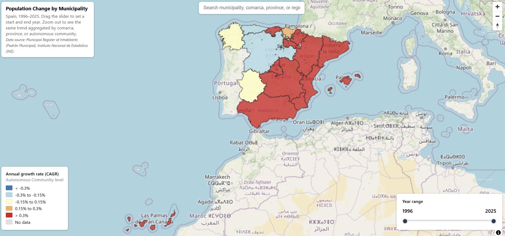

# Spain Demographic Dynamics — Population Change Map

🗺️ **[Live demo](https://juanzotes.github.io/spain-demographic-dynamics-map/)**

An interactive map of population change across every Spanish municipality, 1996–2025. Drag a
free year-range slider to compare any two years and see the annualized growth rate light up
red (growth) to blue (decline). Zoom out and the same trend re-aggregates automatically by
comarca, province, or autonomous community — no reload, no server, one `.pmtiles` file.



---

## The question

Where in Spain is rural depopulation accelerating, and where is it reversing?

---

## The data

- **Padrón Municipal de Habitantes (Municipal Register of Inhabitants), 1996–2025.** ~8,132
  municipalities, annual population counts. Source: [INE (Instituto Nacional de Estadística)](https://www.ine.es).
- **Administrative hierarchy** (municipality → comarca → province → autonomous community).
  Used to build the 4 zoom-dependent aggregation levels.

All data in EPSG:4326 for the web layer (source geometry simplified from the original IGN/INE
administrative boundaries).

---

## Methodology

1. **Extract.** Padrón CSV (long format: municipality, category, year, population) and the
   administrative hierarchy GeoPackage, both processed in Python (pandas, GeoPandas).
2. **Transform.** Pivoted population to one column per year, per municipality. Dissolved the
   same data up to comarca, province, and CCAA level by summing raw population (never by
   averaging percentages — a comarca's growth rate has to come from its total population,
   not from averaging its municipalities' individual rates). Only raw population per year is
   exported; no variation is pre-computed.
3. **Visualize.** GeoJSON → PMTiles (tippecanoe) → MapLibre GL JS, with 4 layers that swap by
   zoom level and a dual-handle year slider.

**Why raw population, not pre-computed % change:** the slider lets you pick *any* start and
end year, not fixed periods. If variation were pre-computed for one interval length, the
color scale would mean something different every time you moved the slider. Instead, the
tile only carries population-per-year, and the browser computes the **annualized growth
rate (CAGR)** for whatever two years you select — so a color always means the same thing,
whether you're comparing 2 years or 29.

**Why 4 separate zoom-dependent layers instead of one:** an 8,132-municipality choropleth is
unreadable at a national scale, and a single national CCAA-level view hides all local detail.
Aggregating to comarca/province/CCAA and swapping layers by zoom keeps every scale legible.

---

## Findings

Two moments stand out when you drag the slider across the full series. Around 2013–2014,
decline was almost universal — the austerity years ("los recortes"), when young adults left
even municipalities that had otherwise been stable for decades. By 2023–2025 that had
flipped: growth became the norm nationally, driven largely by immigration — but the map
splits sharply along a coast/interior line once you isolate that period. The Mediterranean
coastline and the Madrid metropolitan area grow consistently, while the interior of Castilla y León,
Extremadura, and Castilla-La Mancha — plus inland Galicia — keeps declining even as the rest
of the country turns around.

- A handful of municipalities (all of Ibiza's municipalities, most of Tenerife's municipalities,  Marbella...) never show a single losing year across 1996–2025; a much larger set across the interior never shows a single growing one.
- Growth in the interior isn't random: comarca and provincial capitals reliably pull
  population toward them. But there's also a real, more recent uptick in some smaller,
  less populated municipalities — not a broad trend, just patchy pockets. It shows up mostly
  as peri-urban growth ringing those capitals, and occasionally — less often — in genuinely
  remote villages far from any center.

---

## Tech stack

- **MapLibre GL JS.** Open-source vector map rendering, no API key, no usage tier.
- **PMTiles.** The entire tileset (4 layers, all zoom levels) is one static file — no tile
  server, hosted alongside `index.html` on GitHub Pages.
- **tippecanoe.** Vector tile generation, run once in WSL/Ubuntu (no native Windows build).
- **GitHub Pages.** Free static hosting, HTTPS, global CDN.
- **Python (pandas, GeoPandas).** All the data processing — pivoting, dissolving, geometry
  simplification — happens once, ahead of time, in a notebook.

Total monthly cost: $0. Total servers running: 0.

I chose this stack over a database + API backend because the data doesn't change in
real time — it's a fixed historical series. A static file that streams only the bytes the
browser needs (via PMTiles' HTTP range requests) does everything a tile server would, for
free, with nothing to maintain.

---

## How to reproduce

Requires Python (pandas, GeoPandas) and tippecanoe (Linux/WSL only).

```bash
git clone https://github.com/juanzotes/spain-demographic-dynamics-map.git
cd spain-demographic-dynamics-map

# 1. Build the 4 GeoJSON layers + search index (Jupyter, any Python env with geopandas)
jupyter notebook 00_build_population_geojson_layers.ipynb

# 2. Convert to PMTiles (WSL/Ubuntu — tippecanoe has no native Windows build)
./convert.sh

# 3. Serve locally and view
npx http-server -p 8000 -c-1
# open http://127.0.0.1:8000
```

Source data (`data/raw/`) and the intermediate GeoJSON (`data/processed/`) aren't committed
to this repo — they're reproducible from the notebook. `data/derived/` (the `.pmtiles` and
the search index) is committed, since that's what the live site actually serves.

---

## What I learned

This is my second interactive web map — the first was built with Leaflet, and it couldn't
handle a dataset this size; loading 8,132 municipalities across 30 years of data made it
crawl. Switching to MapLibre + PMTiles was the biggest lesson: the same data that choked
Leaflet now loads instantly and the whole site weighs almost nothing, since the browser only
streams the tile bytes it actually needs. Beyond that, most of the remaining work was in the
pieces around the map itself — the year slider, the zoom-dependent legend, the search box.
Getting the legend to stay accurate for *any* start/end year the slider could land on, rather
than a fixed set of periods, took the most iteration.

---

## Author

Juan Zotes Orcajo. Geospatial Research Data Scientist, Universidad Complutense de Madrid.

---

## License

MIT. See `LICENSE` for details.

Data sourced from INE (Instituto Nacional de Estadística) under its standard open reuse terms.
